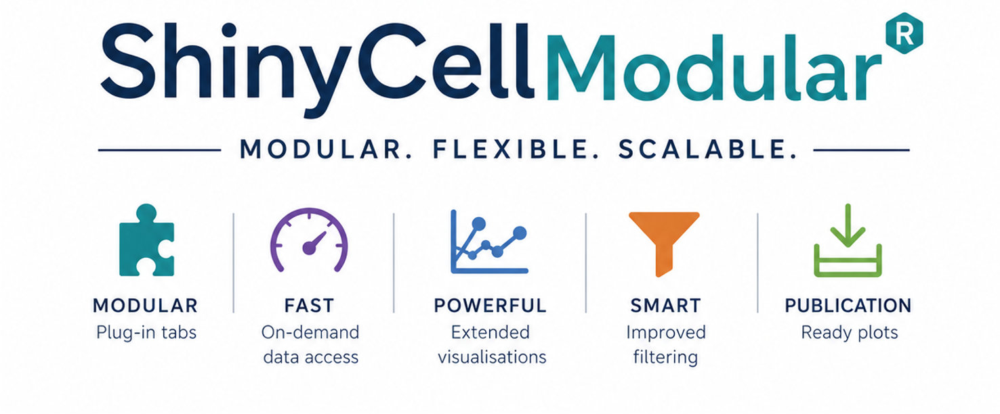

<p align="center">
  
</p>


| Explore an Example | Learn More | Create |
| :---: | :---: | :---: |
| <a href="https://bioinformatics.erc.monash.edu/shinyapps-public/app/scrnaseq-shinycellmodular-example"></a> | <a href="https://monashbioinformaticsplatform.github.io/ShinyCellModular/"></a> | <a href="articles/developer_guide.html"></a> |

***
## Motivation

Single-cell apps rarely stay static once a lab starts using them: labels get reordered, axes get fixed, colours get matched to a figure, a new tab gets requested. If you're running a ShinyCell-based app for more than one project, this will sound familiar: each of those small changes usually means touching a large, interconnected script. That is what **ShinyCellModular** is for: an architecture that lets us keep tailoring single-cell apps to individual researchers and projects, quickly and without waiting on upstream changes.

Most ShinyCell-derived apps are one large, cross-referenced script: tabs share state and call into each other, so touching one thing risks breaking another. ShinyCellModular restructures this as a plugin system: every tab is a self-contained R file (UI + server + `register_tab()`), discovered automatically at build time from a directory listing, with no hard-coded catalogue to edit. Add a tab by dropping in a file; remove one without touching anything else; hand a tab to a team member without them needing to understand the rest of the app.

That architecture is what lets us keep customising ShinyCellModular for our own researchers over time, rather than accumulating one-off patches that get harder to maintain with every request. We build most tabs ourselves, driven by real project needs, but the module structure is deliberately open: see [creating your own modules/tabs](https://monashbioinformaticsplatform.github.io/ShinyCellModular/articles/developer_guide.html) if you want to build on it or adapt it for your own group.

[](https://deepwiki.com/MonashBioinformaticsPlatform/ShinyCellModular)

## What it does? 

**ShinyCellModular** is an R package, a modular version of [ShinyCell](https://github.com/SGDDNB/ShinyCell) developed at the Monash Genomics and Bioinformatics Platform (MGBP). It takes your [Seurat](https://satijalab.org/seurat/) object from single cell experiments and creates an interactive Shiny app to explore your data. Each module is a tab in the app, created individually and self-contained. **ShinyCellModular** supports large scRNAseq and multimodal datasets with fast on-demand HDF5 and parquet access, extended visualisations, improved filtering, and publication-ready plots. Its modular structure makes it flexible, scalable, and easy to customise and to patch.

## Features

- Modular UI and server structure
- Supports scRNAseq, ATAC, and multimodal datasets
- Fast HDF5 and parquet on-demand loading
- Publication-ready plots (PNG/PDF export)
- Extended visualisation tabs (UMAP, 3D UMAP, violin, bubble, heatmap, coexpression, marker genes)
- Pseudobulk differential expression
- Cell subsetting and conditional plotting
- Marker gene visualisation from precomputed parquet files
- Per-tab authorship and metadata footer
- Easy integration with new modules via a registry system
- Deployment to Posit Connect via rsconnect

***
## Fast usage just needs 3 steps

### 1. Setup

Install the package directly from GitHub:

```r
devtools::install_github("MonashBioinformaticsPlatform/ShinyCellModular")
library(ShinyCellModular)
```

The first time you run `prepShinyCellModular` add `install_missing = TRUE` to auto-install any missing dependencies:

```r
prepShinyCellModular(install_missing = TRUE)
```

Run the 2 helper functions `prepShinyCellModular()` and `useShinyCellModular()`

### 2. `prepShinyCellModular()`

```r
library(ShinyCellModular)

# Prepare seurat object, checks Key names, creates sc1counts.h5, adds a 3D UMAP reduction, identify marker genes for all resolutions
prepShinyCellModular(seurat_rds = "seurat_object.rds", # or seurat_obj = cnts,
                     out_dir = "testing_data_RNA", 
                     assays_selected = "RNA", 
                     do_umap3d = TRUE,  
                     do_markers = TRUE
                     #, install_missing = TRUE
                     )
```

### 3. `useShinyCellModular()`
```r
# Create a new app.R with the modular ShinyCellModular tabs

useShinyCellModular(
    out_dir  = "testing_data/",
    data_type = "RNA",
    overwrite_modules = TRUE, # be careful with this if you have done any manual changes to the modules code, it will replace the whole folder with the package modules code
    app_title = "Testing"
)

runApp("testing_data")
# or open app.R and run
```

To include only specific tabs pass their IDs to `enabled_tabs`:

```r
useShinyCellModular(
                    shiny.dir    = "testing_data/",
                    data_type    = "RNA",
                    enabled_tabs = c("cellinfo_cellinfo", "violin_boxplot", "pseudobulk"),
                    app_title    = "Testing"
)
```

***
## Available tabs

Tabs are organised by data type — RNA, ATAC, MULTI (multi-dataset and cross-modal), with SPATIAL and CropSeq/PerturbSeq coming soon. Each tab is enabled by passing its ID to `enabled_tabs` in `useShinyCellModular()`.

See the full list of tab IDs, what each one shows, and any extra `prepShinyCellModular()` steps it needs in [Available tabs](https://monashbioinformaticsplatform.github.io/ShinyCellModular/articles/available_tabs.html).

***
## Legacy version

The pre-package version of ShinyCellModular is preserved in the [`legacy` branch](https://github.com/MonashBioinformaticsPlatform/ShinyCellModular/tree/legacy) for users who are already working with that code. New development happens on `main`.

***
## Acknowledgement

We'd love to hear if ShinyCellModular is useful to you outside MGBP. If you use it in your work or build new modules on top of it, please let us know and acknowledge it in your publications; this helps us track its impact and justify continued development.

***
## AI assistance

The package architecture, and the building and testing of its modules, is the work of Laura Perlaza-Jimenez. Claude (Anthropic) assisted with documentation and the `Dockerfile` and GitHub Actions workflow used to build and publish the ShinyProxy deployment image.

AI assistance is recommended for adding new functionalities and modules, please use the guide provided in [Using an AI agent](https://monashbioinformaticsplatform.github.io/ShinyCellModular/articles/developer_guide_ai_agents.html).
